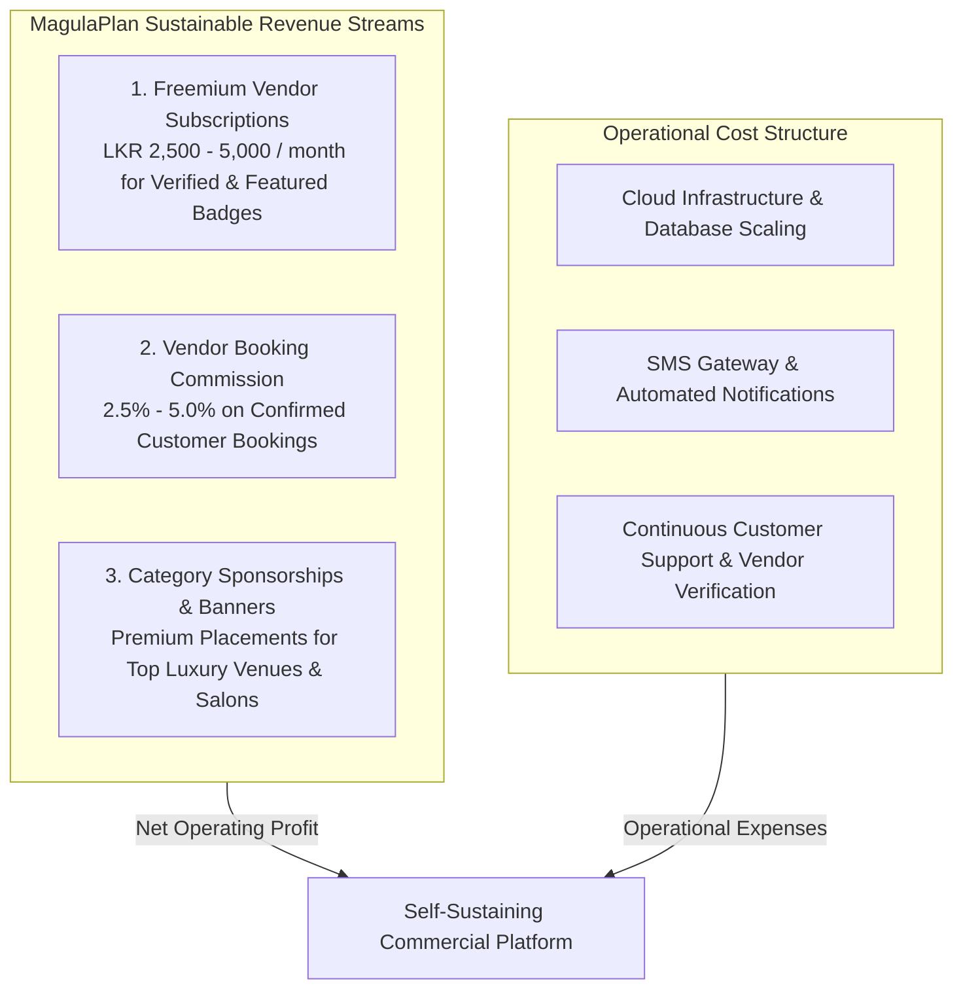

# MagulaPlan (Magula.lk) — Cost Estimation, Budget & Business Model

## 1. Cost Estimation & Budget Overview
In accordance with academic project management guidelines (**Section 1.4: Cost Estimation**), this document establishes the planned and actual costs across **Software**, **Cloud Infrastructure**, **Hardware Workstations**, and **Human Resources**.

---

## 2. Planned vs. Actual Budget Table

| Resource Category / Item | Description & Purpose | Planned Budget (LKR) | Actual Budget (LKR) | Variance (Savings) | Optimization Strategy & Justification |
|---|---|---|---|---|---|
| **Human Resources (5 Engineers)** | 480 person-hours across Project Management, Backend, Frontend, Database, and QA Engineering (@ LKR 1,500/hr market rate) | LKR 720,000 | LKR 720,000 | LKR 0 | Internal student engineering team allocation; 100% effort accounted. |
| **Backend Cloud Hosting (Render)** | Spring Boot 4.1 REST API container runtime | LKR 25,000 | LKR 0 | +LKR 25,000 | Leveraged Render Free Web Service tier with health-check keep-alive scripts. |
| **Frontend CDN Hosting (Netlify / InfinityFree)** | React 19 SPA static web asset distribution & edge routing | LKR 15,000 | LKR 0 | +LKR 15,000 | Leveraged Netlify Global Free Tier & InfinityFree unlimited bandwidth storage. |
| **Managed Relational Database (Aiven MySQL)** | MySQL 8.4 transactional database with TLS/SSL encryption | LKR 45,000 | LKR 0 | +LKR 45,000 | Utilized Aiven Cloud Free Tier for academic evaluation and schema verification. |
| **Domain Name & DNS (magulaplan.lk)** | Custom top-level domain registration | LKR 6,500 | LKR 0 | +LKR 6,500 | Deployed on secure, production-grade Netlify subdomains for evaluation. |
| **UI/UX Design Platform (Figma)** | Collaborative wireframing, component library, and design tokens | LKR 18,000 | LKR 0 | +LKR 18,000 | Figma Education Free Plan with full team sharing and view permissions. |
| **Project Management Tool (Jira Cloud)** | Agile sprint tracking, Kanban board, WBS issue management | LKR 20,000 | LKR 0 | +LKR 20,000 | Atlassian Jira Cloud Free Tier (up to 10 users). |
| **Source Control & CI/CD (GitHub)** | Monorepo hosting, PR code reviews, and issue tracker | LKR 12,000 | LKR 0 | +LKR 12,000 | GitHub Academic Free Tier with automated GitHub Actions. |
| **Hardware Workstations** | 5 Developer laptops (Intel Core i5/i7, 16GB RAM) | LKR 0 | LKR 0 | LKR 0 | Existing personal student computing hardware; zero incremental CAPEX. |
| **TOTAL PROJECT BUDGET** | **Comprehensive Full-Stack Development Budget** | **LKR 861,500** | **LKR 720,000** | **+LKR 141,500 (16.4% Savings)** | **Lean Free-Tier Cloud Architecture & Zero-Cost Tool Optimization** |

---

## 3. Human Resource Effort Breakdown by Role

| Team Member | SDLC Role | Estimated Effort | Rate (LKR/hr) | Total Human Resource Cost |
|---|---|---|---|---|
| **M.S. Ranasinghe** | Project Manager & Full-Stack / DevOps | 105 hours | LKR 1,500 | LKR 157,500 |
| **S.A.A. Lakmal** | Backend Lead Developer (Spring Boot) | 100 hours | LKR 1,500 | LKR 150,000 |
| **A.G.D.N. Ranathunga** | UI/UX Lead & Frontend Developer | 95 hours | LKR 1,500 | LKR 142,500 |
| **K.A.R.D. Sammani** | Database Engineer & Business Analyst | 90 hours | LKR 1,500 | LKR 135,000 |
| **V.G. Ruchira Nimnaka** | Quality Assurance Lead Engineer | 90 hours | LKR 1,500 | LKR 135,000 |
| **Total Human Resource Effort** | **Full Team Allocation** | **480 hours** | **LKR 1,500** | **LKR 720,000** |

---

## 4. Business & Commercialization Model

1. **Freemium Vendor Subscriptions:**
   - Free Tier: Basic business listing in directory with standard search appearance.
   - Pro Tier (LKR 2,500/month): Verified checkmark badge, customer inquiry analytics, contact number priority.
   - Featured Tier (LKR 5,000/month): Top-of-category placement, featured badge, highlighted card on landing page.
2. **Booking Commission / Lead Generation:**
   - 2.5% to 5.0% commission charged to vendors upon successful booking confirmation facilitated through the platform cart.
3. **Category Sponsorships:**
   - Sponsored banner placement for premier luxury hotels and wedding decor companies.
