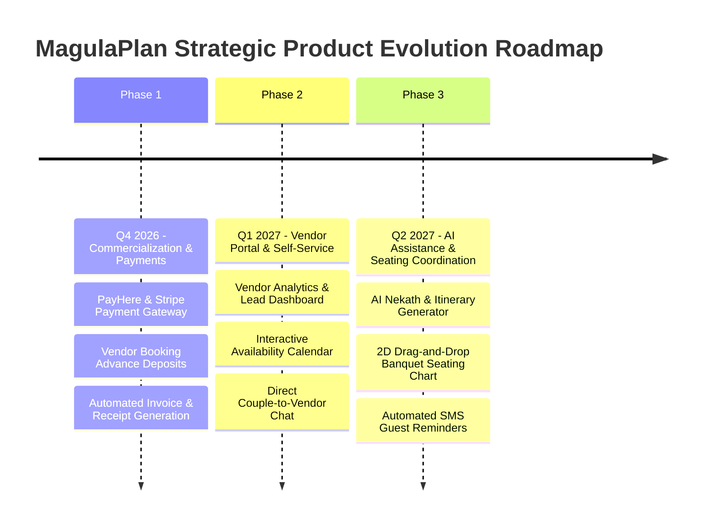

# MagulaPlan (Magula.lk) — Future Upgrades & Product Evolution Roadmap

## 1. Product Vision & Long-Term Roadmap
MagulaPlan is positioned to become Sri Lanka’s premier digital wedding marketplace and planning ecosystem. The following phased development roadmap details the technical and business features scheduled for post-academic implementation.

---

## 2. Strategic 3-Phase Evolution Roadmap

---

## 3. Detailed Feature Specifications for Future Upgrades

### Phase 1: Commercialization & Payment Gateway Integration (Q4 2026)
1. **PayHere / Stripe Online Payment Gateway:**
   - Enable direct advance payments and deposits for booked vendors using Visa, MasterCard, and LankaQR.
   - Implement automated escrow holds released to vendors upon service delivery verification.
2. **Automated Digital Invoicing & Tax Receipts:**
   - PDF generation of booking invoices, receipts, and payment schedules for couples and vendors.
3. **SMS & Email Notification Service (Twilio / SendGrid):**
   - Automated RSVP change alerts, vendor booking updates, and payment milestone reminders.

---

### Phase 2: Vendor Self-Service & Commerce Management Portal (Q1 2027)
1. **Dedicated Vendor Admin Dashboard:**
   - Allow registered vendors to log in, customize service packages, update pricing tiers, and upload portfolio photo galleries.
2. **Live Vendor Availability Calendar:**
   - Interactive calendar booking sync preventing double-booking on popular Sri Lankan auspicious wedding dates (Nekath days).
3. **In-App Direct Messaging System:**
   - Real-time chat powered by Spring WebSockets / STOMP allowing couples to message vendors directly with attached reference photos.

---

### Phase 3: AI Planning Assistance & Advanced Logistics (Q2 2027)
1. **AI Astrological Nekath & Itinerary Generator:**
   - Generative AI tool that calculates personalized ceremony run-of-show timelines based on couple astrologer auspicious Nekath times.
2. **Interactive 2D Banquet Seating Chart:**
   - Visual drag-and-drop table layout editor mapped directly to confirmed RSVP guests, dietary requirements, and family sides.
3. **Multi-Language Support (Sinhala, Tamil, English):**
   - Complete localized platform internationalization (i18n) catering to all communities across Sri Lanka.
