# MagulaPlan (Magula.lk) — High-Level Architecture Diagram

## 1. System Architecture Overview
MagulaPlan is engineered following a modular **3-Tier Layered Architecture** that separates the Presentation, Application / Business Logic, and Data Persistence layers. This decoupled architecture ensures high scalability, maintainability, and clean separation of concerns.

---

## 2. High-Level Architecture Diagram (Mermaid)

```mermaid
flowchart TB
    subgraph ClientTier[Presentation Tier - Client Layer]
        SPA[React 19 Single Page Application]
        Vite[Vite 8 Build Engine]
        Tailwind[Tailwind CSS 3.4 & Storybook Romance Tokens]
        Recharts[Recharts Interactive Financial Analytics]
        Timer[Event Countdown & Nekath Milestones]
        WebShare[Web Share API & WhatsApp Click-to-Chat]
    end

    subgraph SecurityGateway[Security & API Gateway Layer]
        CORS[Dual-Origin CORS Whitelist Netlify & Local]
        AuthFilter[SessionTokenAuthenticationFilter]
        BCrypt[BCrypt Password Cryptography]
        RBAC[Spring Security RBAC USER / ADMIN]
    end

    subgraph ApplicationTier[Application Tier - Spring Boot 4.1 Services]
        AuthSvc[AuthService & User Registration]
        VendorSvc[VendorService & Category Service]
        BudgetSvc[BudgetItemService & Financial Summary]
        GuestSvc[GuestService & Digital Invitation Generator]
        BookingSvc[BookingService & Cart Checkout Engine]
        AdminSvc[AdminService & Vendor Moderation]
        NotifSvc[NotificationService]
    end

    subgraph DataTier[Data Tier - Persistence & Database Layer]
        JPA[Spring Data JPA & Hibernate 7.4]
        MySQL[(MySQL 8.4 Relational Database)]
        Seed[Idempotent Data Seeding Engine data_seed.sql]
    end

    ClientTier -->|HTTPS REST JSON + Bearer Session Token| SecurityGateway
    SecurityGateway --> ApplicationTier
    ApplicationTier -->|JPA Queries & Transactions| DataTier
```



---

## 3. High-Level Architecture Diagram (ASCII for Presentation Slides)

```
+=============================================================================+
|                      MAGULAPLAN 3-TIER SYSTEM ARCHITECTURE                  |
+=============================================================================+
| [1. PRESENTATION TIER - Client Single Page Application]                     |
|   • React 19 SPA (Vite 8, Tailwind CSS 3.4)                                 |
|   • Storybook Romance & Modern Editorial Design Tokens                      |
|   • Client Routing (React Router DOM v7) & Framer Motion                    |
|   • Recharts Financial Spend Breakdown & Real-time Budget Metrics           |
|   • Event Countdown Timer (Poruwa, Nekath, Reception Milestones)            |
|   • Mobile Web Share API & WhatsApp Click-to-Chat Link Generation           |
+-----------------------------------------------------------------------------+
                                       |
                                       | HTTPS / REST JSON API
                                       | Bearer Session Token Authorization
                                       v
+-----------------------------------------------------------------------------+
| [2. APPLICATION TIER - Spring Boot 4.1 REST Microservices]                 |
|   • Security Filter: SessionTokenAuthenticationFilter (RBAC)                |
|   • Cryptography: BCrypt Password Hashing (BCryptPasswordEncoder)           |
|   • CORS Whitelisting: Dual-Origin (Netlify Production & Localhost)         |
|   • Core Controllers & Services:                                            |
|     - AuthController / UserService (UUID Session Tokens, Profile /me)       |
|     - VendorController / VendorService (Search, Filter, Pagination, Rating) |
|     - BudgetItemController / BudgetItemService (Financial Summary)          |
|     - GuestController / GuestService (RSVP Tracking, Invitation Links)      |
|     - BookingController / BookingService (Multi-Vendor Cart Checkout)       |
|     - AdminController / AdminService (Vendor Moderation & System Metrics)   |
|     - NotificationController / NotificationService                          |
+-----------------------------------------------------------------------------+
                                       |
                                       | Spring Data JPA / Hibernate 7.4
                                       | TLS/SSL Encrypted JDBC Connection
                                       v
+-----------------------------------------------------------------------------+
| [3. DATA TIER - MySQL 8.4 Relational Database]                              |
|   • 7 Normalized Relational Tables:                                         |
|     - `users` (Session tokens, BCrypt hashes, wedding dates, budgets)       |
|     - `vendors` (Rich ratings, reviews, pricing, verification status)       |
|     - `vendor_categories` (8 core Sri Lankan wedding industry domains)     |
|     - `budget_items` (Itemized estimates, actuals, deposit tracking)        |
|     - `guests` (RSVP status, plus-ones, meal preferences, WhatsApp status)  |
|     - `bookings` (Multi-vendor confirmed cart bookings)                     |
|     - `notifications` (In-app alerts and planning updates)                  |
|   • Idempotent Data Seeding Engine (`data_seed.sql`)                         |
+=============================================================================+
```

---

## 4. Key Architectural Patterns & Technical Decisions
1. **Stateless Session Token Authentication:** Instead of complex JWT signature overhead, the system issues cryptographically secure 64-character UUID session tokens validated via `SessionTokenAuthenticationFilter`, ensuring sub-millisecond authentication lookups and straightforward invalidation on logout.
2. **Dual-Tier Resilient Data Fallbacks:** The frontend features an embedded fallback dataset (`seedVendors.js`) containing 13 verified Sri Lankan vendor profiles across 8 categories, ensuring zero UI disruption during cloud cold starts.
3. **Idempotent Relational Seeding:** The backend database utilizes `INSERT ... ON DUPLICATE KEY UPDATE` to guarantee safe, repeatable deployment scripts across local H2, Aiven Cloud, and InfinityFree environments.
