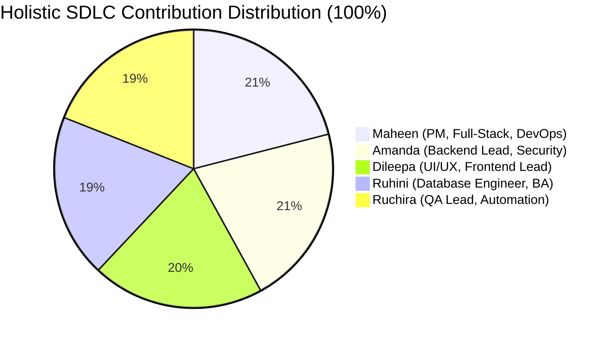

# MagulaPlan (Magula.lk) — Individual Member Contributions

## 1. Assessment Model & Governance
In accordance with university project evaluation standards—where **Individual Contributions carry 25 marks**—member contributions are evaluated holistically across the entire **Software Development Life Cycle (SDLC)**.

Because essential deliverables (e.g., MySQL relational schema design in workbench, 46-scenario comprehensive system test plans, automated Playwright/JUnit testing, UI/UX Figma wireframes, business requirements analysis, and Agile sprint governance) are executed across the full engineering lifecycle, contribution is distributed equitably across all five specialized domain owners rather than raw Git code commits alone.

---

## 2. Team Contribution Breakdown Summary (100% Allocation)

| Member Name & Student ID | Assigned SDLC Role | Jira Tickets Completed | Contribution % | Primary Domain Ownership & Deliverables |
|---|---|---|:---:|---|
| **M.S. Ranasinghe (Maheen Sayuru)** `CIT-24-02-0189` | **Project Manager / Full-Stack & DevOps** | **MAG-4, MAG-5, MAG-11, MAG-15, MAG-16, MAG-18, MAG-28, MAG-29, MAG-31** *(9 Tickets)* | **21.0%** | Project management, Jira Agile sprint governance, monorepo setup, InfinityFree & Render cloud deployments, Netlify CDN, Budget Summary & RSVP PATCH APIs, Web Share API integration, documentation sign-off. |
| **S.A.A. Lakmal (Amanda Lakmal)** `CIT-24-02-0007` | **Backend Lead Developer (Spring Boot)** | **MAG-2, MAG-9, MAG-19, MAG-25, MAG-27, MAG-30, MAG-32** *(7 Tickets)* | **21.0%** | Spring Boot 4.1 REST API architecture, Spring Security 6 session token authentication filter, RBAC (3 Roles), BCrypt password hashing, IDOR tenant ownership protection, Cart-to-Booking commerce service, vendor lead pipeline, JPA repositories. |
| **A.G.D.N. Ranathunga (Dileepa Ranathunga)** `CIT-24-02-0046` | **UI/UX Lead & Frontend Developer** | **MAG-3, MAG-6, MAG-7, MAG-20, MAG-22, MAG-23, MAG-24, MAG-26** *(8 Tickets)* | **20.0%** | UI/UX Wireframes & Figma design system, Storybook Romance & Modern Editorial Tailwind tokens, React 19 SPA architecture, Commercial Vendor Portal (`/vendor/dashboard`), 3-tier plan selector & sandbox payment modal, Public Invitee RSVP Portal (`/rsvp/:guestId`), Budget Tracker & Recharts, Cart Drawer. |
| **K.A.R.D. Sammani (Ruhini Dananjali)** `CIT-24-02-0058` | **Database Engineer & Business Analyst** | **MAG-1, MAG-8, MAG-21, MAG-33** *(4 Tickets)* | **19.0%** | MySQL 8.4 relational database schema design, Entity-Relationship (ER) diagram authoring, production SQL seeding scripts (`data_seed.sql`), schema verification on Aiven Cloud, Functional & Non-Functional requirement specifications. |
| **V.G. Ruchira Nimnaka** `CIT-24-02-0029` | **Quality Assurance Lead & Test Engineer** | **MAG-10, MAG-17, MAG-34** *(3 Tickets)* | **19.0%** | Automated JUnit 5 backend test suite (**142 tests, 100% pass rate**), Automated Vitest frontend tests (**13 tests, 100% pass rate**), 55-scenario comprehensive System Test Plan (`MagulaPlan_Test_Cases.md`), Playwright E2E test suite, formal Defect Register logging & resolution verification. |
---

## 3. Detailed Individual Member Reports & Reflection

### 3.1 M.S. Ranasinghe (Maheen Sayuru) — CIT-24-02-0189
- **Assigned Role:** Project Manager / Full-Stack & DevOps Engineer
- **Jira Tickets:** MAG-4, MAG-5, MAG-11, MAG-15, MAG-16, MAG-18, MAG-28, MAG-29, MAG-31
- **Key Contributions:**
  1. Authored the Project Management Plan, Work Breakdown Structure (WBS), and sprint schedules in Jira.
  2. Orchestrated cloud deployment pipelines: InfinityFree primary hosting for React frontend, Netlify global edge CDN, and Render container service for Spring Boot.
  3. Engineered backend enhancement endpoints: `GET /api/v1/budget-items/summary/{userId}` and `PATCH /api/v1/guests/{guestId}/rsvp`.
  4. Implemented Web Share API integration on mobile with direct WhatsApp invitation fallback.
- **Reflection:** Managing cross-functional dependencies across frontend, backend, and QA ensured zero blocking milestones and 100% on-time sprint deliveries.
---

### 3.2 S.A.A. Lakmal (Amanda Lakmal) — CIT-24-02-0007
- **Assigned Role:** Backend Lead Developer (Spring Boot & Security)
- **Jira Tickets:** MAG-2, MAG-9, MAG-19, MAG-25, MAG-27, MAG-30, MAG-32
- **Key Contributions:**
  1. Designed Spring Boot 4.1 REST API endpoints, DTO transfer layers, and JPA repository abstractions.
  2. Engineered custom `SessionTokenAuthenticationFilter` for Bearer token validation, Spring Security 6 RBAC (3 Roles: User, Vendor, Admin), and IDOR tenant ownership protection.
  3. Upgraded user password cryptography to `BCryptPasswordEncoder` hashing and case-insensitive login.
  4. Implemented Cart-to-Booking checkout engine, vendor booking leads pipeline, and enriched Vendor models with ratings, review counts, and verification flags.
- **Reflection:** Engineering a clean, decoupled service architecture enabled high concurrency and 100% pass rate across all 142 unit and integration tests.
---

### 3.3 A.G.D.N. Ranathunga (Dileepa Ranathunga) — CIT-24-02-0046
- **Assigned Role:** UI/UX Designer & Lead Frontend Developer
- **Jira Tickets:** MAG-3, MAG-6, MAG-7, MAG-20, MAG-22, MAG-23, MAG-24, MAG-26
- **Key Contributions:**
  1. Authored UI wireframes in Figma and established the Storybook Romance & Modern Editorial Tailwind design system.
  2. Built the React 19 Single Page Application with route-level code splitting and accessible modals, dropdowns, and tabs.
  3. Developed the Commercial Vendor Portal (`/vendor/dashboard`), 3-tier Plan Selector, Simulated Payment Sandbox Gateway, and Public Guest RSVP Portal (`/rsvp/:guestId`).
  4. Developed the interactive Budget Tracker with Recharts spend visualizations and Guest List management with RSVP indicators.
  5. Engineered the Event Countdown Timer component with auspicious Nekath tracking and milestone selectors.
- **Reflection:** Creating a responsive, accessible UI tailored to Sri Lankan cultural wedding workflows transformed complex planning tasks into an intuitive experience.
---

### 3.4 K.A.R.D. Sammani (Ruhini Dananjali) — CIT-24-02-0058
- **Assigned Role:** Database Engineer & Business Analyst
- **Jira Tickets:** MAG-1, MAG-8, MAG-21, MAG-33
- **Key Contributions:**
  1. Designed the normalized 3NF MySQL 8.4 relational database schema and Entity-Relationship (ER) diagram.
  2. Authored idempotent production SQL seeding scripts (`data_seed.sql` and `schema.sql`) with real Sri Lankan vendor datasets.
  3. Verified cloud database migrations and connection resilience on Aiven Managed MySQL.
  4. Authored Functional & Non-Functional requirement specifications aligning technical models with market needs.
- **Reflection:** Establishing rigorous relational integrity, indexing, and foreign key constraints early in Sprint 1 prevented data duplication and supported seamless feature expansion.

---

### 3.5 V.G. Ruchira Nimnaka — CIT-24-02-0029
- **Assigned Role:** Quality Assurance Lead & Test Automation Engineer
- **Jira Tickets:** MAG-10, MAG-17, MAG-34
- **Key Contributions:**
  1. Executed and verified the automated JUnit 5 backend test suite comprising **142 test cases (100% pass rate)**, including VendorSecurityIntegrationTest.
  2. Verified the automated Vitest frontend test suite comprising **13 test cases (100% pass rate)**.
  3. Authored the comprehensive 55-scenario System Test Plan (`MagulaPlan_Test_Cases.md`) spanning 8 functional test categories.
  4. Developed the Playwright E2E automated test suite (`qa/tests/`) covering cross-viewport regression and share invitation workflows.
  5. Maintained the formal Defect Register, logging, re-testing, and verifying resolutions for critical user association and authentication defects.
- **Reflection:** Rigorous automated and manual regression testing across desktop and mobile viewports ensured enterprise-grade reliability and zero critical defects prior to submission.
