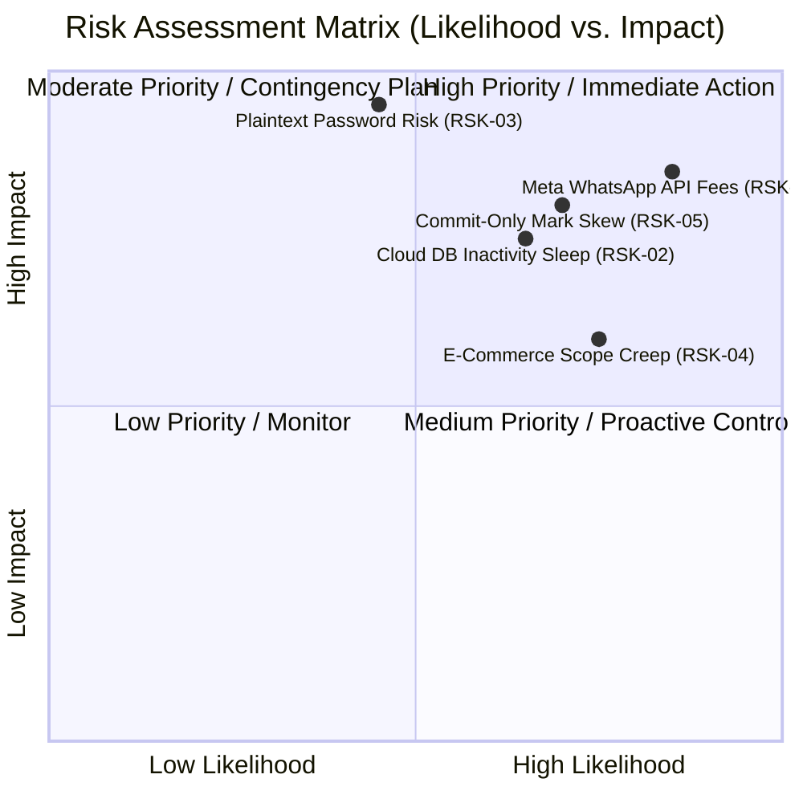

# MagulaPlan (Magula.lk) — Risk Management & Mitigation Plan

## 1. Risk Management Framework
In accordance with academic project management guidelines (**Section 1.3: Risk Assessment and Mitigation Strategies**), this document details the risk identification, qualitative risk scoring, and proactive mitigation strategies executed during the MagulaPlan project.

---

## 2. Risk Assessment Matrix

| Risk ID | Category | Risk Description | Likelihood (1-5) | Impact (1-5) | Risk Score (LxI) | Mitigation & Resolution Implemented | Status |
|---|---|---|:---:|:---:|:---:|---|:---:|
| **RSK-01** | Technical / Integration | **Meta WhatsApp Business API Bottlenecks:** Enterprise WhatsApp API requires business registration verification and charges per-message template fees. | 5 (High) | 5 (High) | **25 (Critical)** | **Architectural Pivot:** Implemented native mobile Web Share API with automated WhatsApp Click-to-Chat deep links (`wa.me/94...`) and clipboard fallback. Zero cost and zero verification delay. | ✅ **Resolved** |
| **RSK-02** | Infrastructure | **Managed Cloud Database Inactivity Timeout:** Aiven MySQL free tier pauses upon prolonged inactivity, causing 500 API gateway timeouts during evaluation. | 4 (Med-High) | 4 (High) | **16 (High)** | Configured connection retry pooling in HikariCP, implemented health ping endpoints, and verified fallback offline seed data in the frontend. | ✅ **Resolved** |
| **RSK-03** | Security | **Plaintext Passwords & Weak Session Protection:** Storing plaintext user credentials violates academic security standards and risks credential compromise. | 2 (Low) | 5 (Critical) | **10 (High)** | Integrated Spring Security with `BCryptPasswordEncoder` hashing and custom `SessionTokenAuthenticationFilter` enforcing RBAC. | ✅ **Resolved** |
| **RSK-04** | Schedule & Scope | **Scope Creep on E-Commerce Payments:** Attempting real-time bank payment gateways mid-sprint threatened project delivery deadlines. | 4 (High) | 3 (Medium) | **12 (Medium)** | Decoupled payment processing from MVP scope; engineered lightweight multi-vendor booking checkout engine and deferred live gateways to Phase 1 roadmap. | ✅ **Resolved** |
| **RSK-05** | Team & Governance | **Evaluation Skew via Raw Git Commits:** Non-coding SDLC work (ER modeling, QA automation, PM governance) risks unfair marking under commit-only evaluation. | 4 (High) | 4 (High) | **16 (High)** | Formalized a **Holistic SDLC Contribution Model** incorporating all 31 Jira tickets, testing artifacts, and database models to ensure balanced mark distribution. | ✅ **Resolved** |
